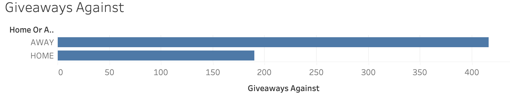
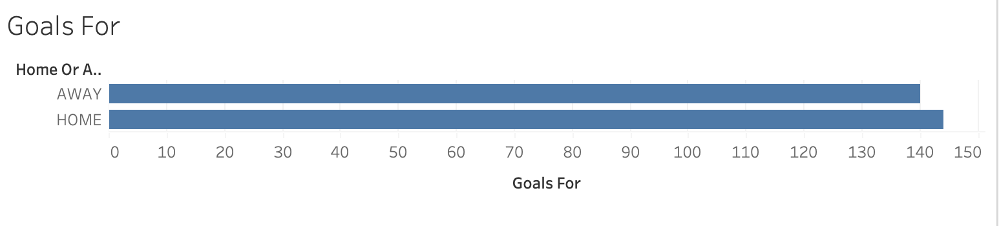
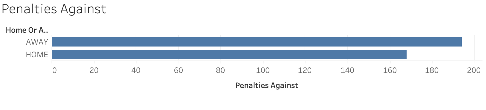
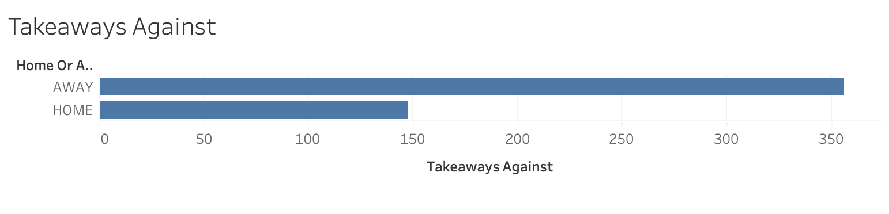

# Impact of Travel on Performance in Hockey  

*By Keegan Macumber* 

## Executive Summary  

This project takes a dive into the importance of travel in hockey and how it can impact performance. This impact can negatively affect performance by causing fatigue due to disrupted sleep patterns from time changes, leading to slower reaction times, lower energy levels, and even an increased risk of injury (Kneeland, 2014). Travelling long distances across numerous time zones is very common in professional hockey leagues. Fatigue has the potential to affect Team Goals for, Team Goals Against, Penalties taken, Giveaways, and takeaways against.

[Read more](background.md)

## Key Performance Indicators (KPIs) 

**Goals For**
- Goals for is an important perforance measurement as it reflects offensive contribution in hockey. If a teams goals for on away games is low and higher on home games it means that they are less successful on the road. 

**Goals Against**
- Refelcts how well a team or individuals defend, particulary under potential physical and mental fatigue that can come with travel. Tracking goals against helps highlight whehter a teams defensive strategy or performance is being impacted by travel-related challenges. 

**Penalties Taken**
- Is an important measure penalties taken as it can identify whether fatigue is affecting a player or teams performance based off players being more prone to take penatlies due to impaired judgement, slower reflexes and mental state all from the impact of travel. 

**Giveaways**
- Giveaways directly impact a teams ability to maintain possession of the puck and execute a game plan. Monitoring giveaways offers insights on a how players and teams are managing the effects of travel. 

**Takeaways Against**
- Takeaways are caused from the other team taking the puck off a players stick, this is an important performance indicator to track as it can show which players are not skating as fast as normal and are being caught and stripped of the puck by the other team.

**Analysis**
  

The image is showcasing the total number of Goals Against for the Los Angeles Kings during the 2020-2021 season for both home and away games, this is important to track as it showcases it is more common to be socred on during road games vs. home games. This is due to fatigue and tiredness from traveling. 

This image is showcasing the total number of giveaways against for the LA Kings during the 2020-2021 season, as you can tell more giveaways result during road games. 

Showcases the total Goals for, for the LA Kings during the 2020-2021 season. Showcasing goals for are lower on road games, and more goals were scored at home by the Kings in the 2021 season. 

Shows penalties taken at home games vs. away games, more penatlies are taken throughout the season by the Los Angeles Kings on the road compared to home games, as players are lazier and take more penalties on opposing teams players. 

The image shows takeaways against by opposing teams on the LA Kings for the Kings home vs. away games, as we can see it is more common for LA to have the puck taken away form them on the roa, this is due to home teams having quicker feet, and more strucutre due to less travel. 

 

 
